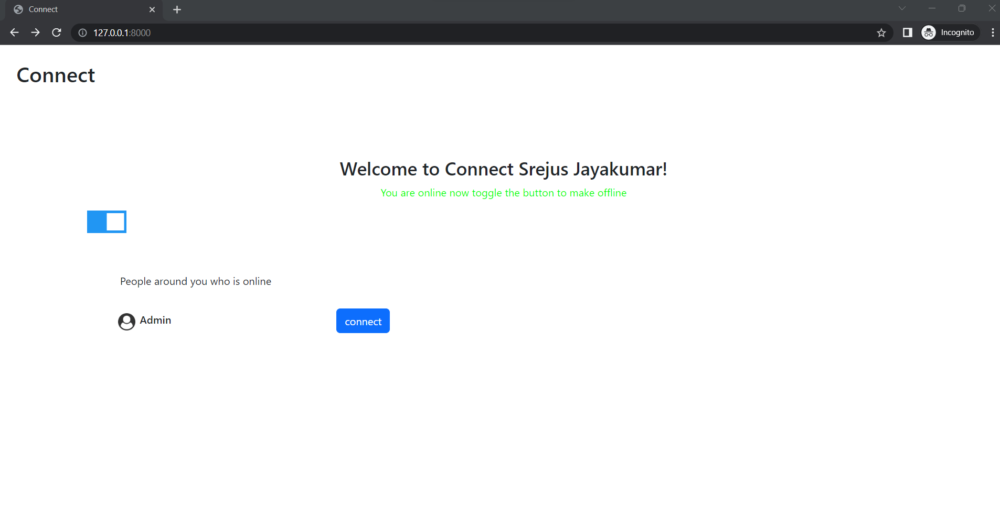
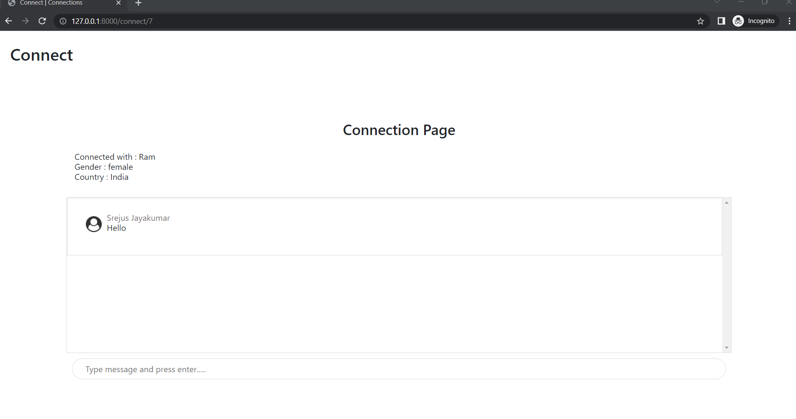

# Connect -(with Django Channels)

Connect with others online 

## Description

Simple implementation of django channels to connect with other people online

Frontend
HTML,CSS,JS

Backend
Django,django-channels

## Installation

Just clone this repository and do the migrations

Login credentials

Admin
username - admin
password - admin123

# Screenshots

